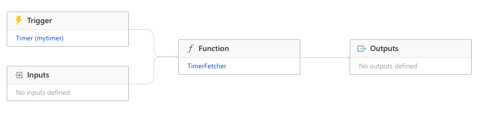
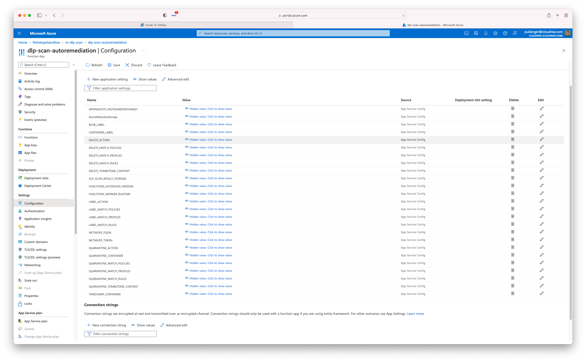
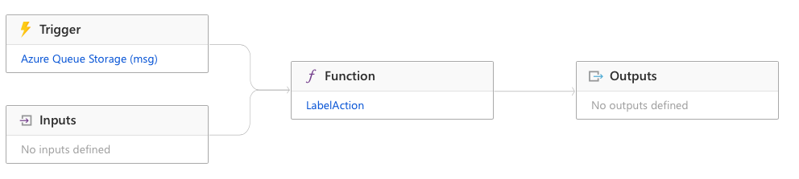

# DLP-Scan-Azure-AutoRemediation – Public Cloud Infrastructure Data Protection Auto-remediation framework for Microsoft Azure

## Overview

This solution is an auto-remediation framework for Netskope Public Cloud Data Protection. Automated actions are taken for DLP Storage Scanning (DLP Scan) policy alerts found for configured Microsoft Azure Public Cloud Infrastructure accounts.

Scan public cloud storage services across AWS, Microsoft Azure, and Google Cloud for sensitive content, then automatically take remediative actions using this framework. The framework can be extended and customized for your specific data security and process requirements.

### Flow Diagram


### Advanced DLP for Public Cloud Storage Services

- Sensitive data discovery: Find, classify, and protect sensitive data stored in public cloud storage services with Netskope’s industry-leading pattern and profile capabilities.
- Malware protection: Discover malware hidden in storage services and prevent it from spreading across your cloud environments.
- Customizable policies: Leverage existing DLP policies or craft new ones to optimize alerting workflows and prevent false positives.
- Back in time scanning: Discover sensitive data and malware already stored in existing public cloud storage services.

Netskope Auto-remediation solution for Microsoft Azure deploys the set of Azure functions that query the above Netskope API on the scheduled intervals, and mitigates supported violations automatically.
You can deploy the framework as is or customize it to mitigate other security violations and to meet your specific organization’s specific security requirements.

## Actions

The DLP Scan auto-remediation framework supports a number of auto-remediation actions for data identified by Netskope's DLP Storage Scanning functionality. Each action can be enabled for a set of DLP policies, profiles and rules. When enabling Netskope Public Cloud Data Protection within Netskope an API Data Protection policy is created which is made up of profiles and rules. When installing this framework via the ARM template and deploy script each action can be enabled or disabled via the ARM parameters file, and can be tuned via parameters to take remediative action at the policy, profile or rule level for one or more policies, profiles, or rules. The specific auto-remediations are described in the next sections.

### Delete Objects

The delete objects auto-remediation action will remove identified data objects from the Azure Storage container where they are found. The automation drops a user configurable tombstone file in place of the removed content to identify content that has been deleted by the policy. The tombstone file content can be changed by the user via parameter, and supports template substitutions allowing the identified policy, profile, and rule for the given alert.

#### Default Tombstone Content

```python
"This object has been deleted due to security policy.\nPolicy: {policy}\nProfile: {profile}\nRule: {rule}"
```

### Label Container and Blob Objects

The label bucket and object auto-remediation will attach metadata to the identified blobs and/or the containers containing the blobs, to allow for other scripts and functionality to process labeled items. The automation will add metadata to the container, the blob, or both container and blob. The tag content is user-configurable via parameter and supports substitutions for the policy profile and rule that triggered the alert.

#### Default Tag Value: (Bucket and Object)

```python
"DLP Alert {policy} {profile} {rule}"
```

### Quarantine Objects

The quarantine objects auto-remediation action will move identified data objects into a quarantine container within the security resource group from the Azure Storage containers where they are found. The automation drops a user-configurable tombstone file in place of the removed content to identify content that has been deleted by the policy. The tombstone file content can be changed by the user via parameter, and supports template substitutions allowing the identified policy, profile and rule for the given alert.

#### Default Quarantine Tombstone Content

```python
"This object has been quarantined due to security policy.\nPolicy: {policy}\nProfile: {profile}\nRule: {rule}"
```

## Deployment

Deployment of the storage scanning autoremediations involves running a command line script which configures a resource group and associated function app, and then publishes fetcher and remediation functions to the newly created function application. Configuration of the function app is primarily handled via an ARM parameters json file.

### Prerequisites

#### Configure your environment to deploy Azure Function from VS Code

Make sure you have the following requirements in place:

- An Azure account with an active subscription. [Create an account for free](https://azure.microsoft.com/free).
- The [Azure Functions Core Tools](https://docs.microsoft.com/en-us/azure/azure-functions/functions-run-local#install-the-azure-functions-core-tools) version 3.x.
- [Python versions that are supported by Azure Functions](https://docs.microsoft.com/en-us/azure/azure-functions/supported-languages#languages-by-runtime-version)
- [Visual Studio Code](https://code.visualstudio.com/) on one of the [supported platforms](https://code.visualstudio.com/docs/supporting/requirements#_platforms).
- The [Python extension](https://marketplace.visualstudio.com/items?itemName=ms-python.python) for Visual Studio Code.
- The [Azure Functions extension](https://marketplace.visualstudio.com/items?itemName=ms-azuretools.vscode-azurefunctions) for Visual Studio Code

#### NOTE: Running the deployment scripts will require an Azure Active directory credential that can create Azure resources for the required subscriptsions

### Deploy 1. Update ARM template parameters

Application configuration is managed by adding parameters to [deploy.parameters.json](./ARM/deploy.parameters.json). The list of possible parameters is in [deploy.json](./ARM/deploy.json)

Each of the actions described above can be enabled, and then Netskope API Protection policies, profiles and rules can be listed for each action to perform specific remediations for each alert within a given set of policies, dlp profiles or rules.

### Deploy 2. Run the deployment shell script

To deploy the Azure remediation and fetcher functions run the [deploy.sh](./deploy.sh) bash script. It will ask you to provide names for the resource group, function application name, Azure installation region and your netskope API access token for your netskope tenant.

This script takes a bit of time to complete, but once it finished. The Function app and associated functions will be deployed within the mew resource group.

```bash
$> bash deploy.sh
```

### Deploy 3. Assign Roles for the System Assigned Managed Identity

In order for the Auto-remediation functions within the Function app to perform actions on the containers and blobs within the scanned storage accountes. A role must be assigned within each target storage account for the Function App's security principal. This can be done in a number of ways. A bash script [assign_security_identity.sh](./assign_security_identity.sh) is included in this framework.

The `assign_security_identity.sh` script can be run once for each storage account that should be affected by the auto-remediations. The script will ask for the security function app name, and the target storage account details (subscription name, resource group, and storage account).

```bash
$> bash assign_security_identity.sh
```

## Components

### HTTPFetcher

The HttpFetcher function will fetch alerts for an Auto-remediation action and process them into the remediation actions Message Queue. The HttpFetcher provides a way to trigger the results processing from outside of the Azure system. The function takes a request body which includes the following parameters


```json
{
    "action": "label",
    "policies": "policy1, policy2",
    "profiles": "profile1, profile2",
    "rules": "rule1"
}
```

The policy profile and rule fields include the Netskope DLP policy, profile and rule alerts that the autoremediation will execute upon. The action field can contain "delete", "label," or "quarantine" and will cause that autoremediation to be applied for the given policies, profiles and rules.

### TimerFetcher

The TimerFetcher function will fetch alerts for an Auto-remediation action and process them into the remediation actions Message Queue, on a scheduled trigger. The TimerFetcher uses the Parameters defined within the FunctionApp parameters to gather alert results and perform the associated Autoremediation actions based on the configuration.



Each Autoremediation action has an associated enable parameter and match parameters for dlp policies, profiles, and rules. The enabled autoremediation will be made on the discovered DLP artifact when the alert policy, profile or rule matches the configured set.



### Action Functions

Each remediation action is triggered by an Azure message queue. When the Fetcher places an alert into the queue the remediation action is executed. The function executes with the service principal assigned my Azure for the security resource group. In order to make changes to the target storage accounts, containers, and blobs, the security principal for the function app needs to be assigned a role that allows at least "Storage Blob Data Contributor" access. This is the function that the `assign_security_identity.sh` script performs.



### Reference

Netskope REST API Token: <https://docs.netskope.com/en/netskope-platform-rest-apis.html>

Function App: <https://docs.microsoft.com/en-us/azure/azure-functions/>

Queue Storage Triggers and Bindings for Function App: <https://docs.microsoft.com/en-us/azure/azure-functions/functions-bindings-storage-queue>

HTTP Triggers for Function App: <https://docs.microsoft.com/en-us/azure/azure-functions/functions-bindings-http-webhook>

Timer Triggers for Function App: <https://docs.microsoft.com/en-us/azure/azure-functions/functions-bindings-timer?tabs=python>

Create Deploy JSON template: <https://docs.microsoft.com/en-us/azure/azure-resource-manager/templates/quickstart-create-templates-use-visual-studio-code?tabs=CLI>

Function App CLI: <https://docs.microsoft.com/en-us/azure/azure-functions/create-first-function-cli-python>

Function App VS Code: <https://docs.microsoft.com/en-us/azure/azure-functions/create-first-function-vs-code-python>

Continuous Deployment: <https://docs.microsoft.com/en-us/azure/azure-functions/functions-continuous-deployment>

FunctionApp ARM Template: <https://github.com/Azure/azure-quickstart-templates/tree/master/quickstarts/microsoft.web>
