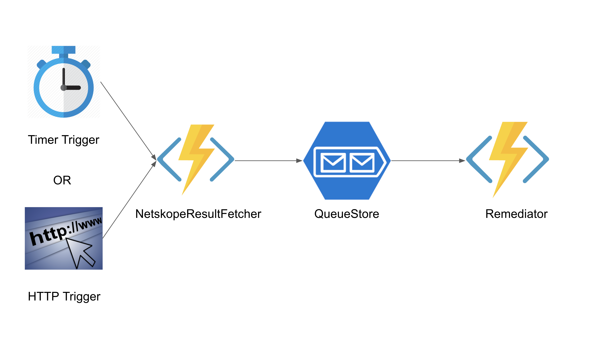
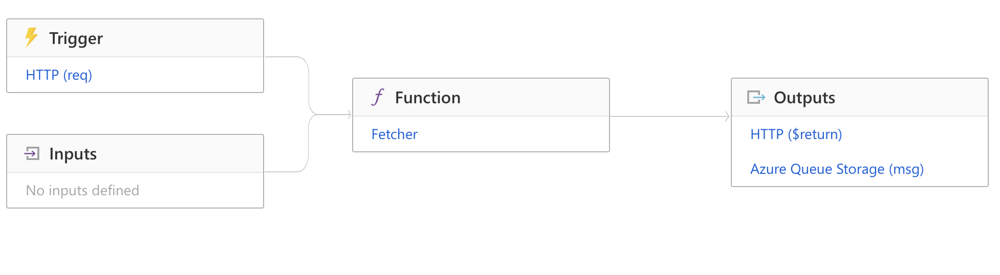
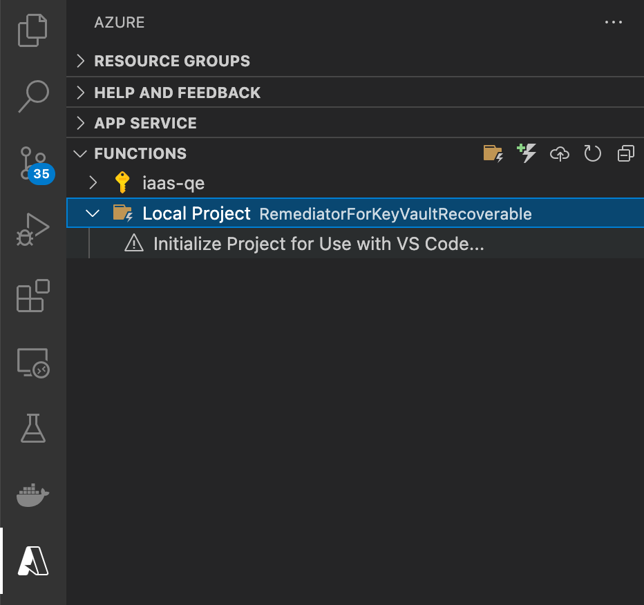
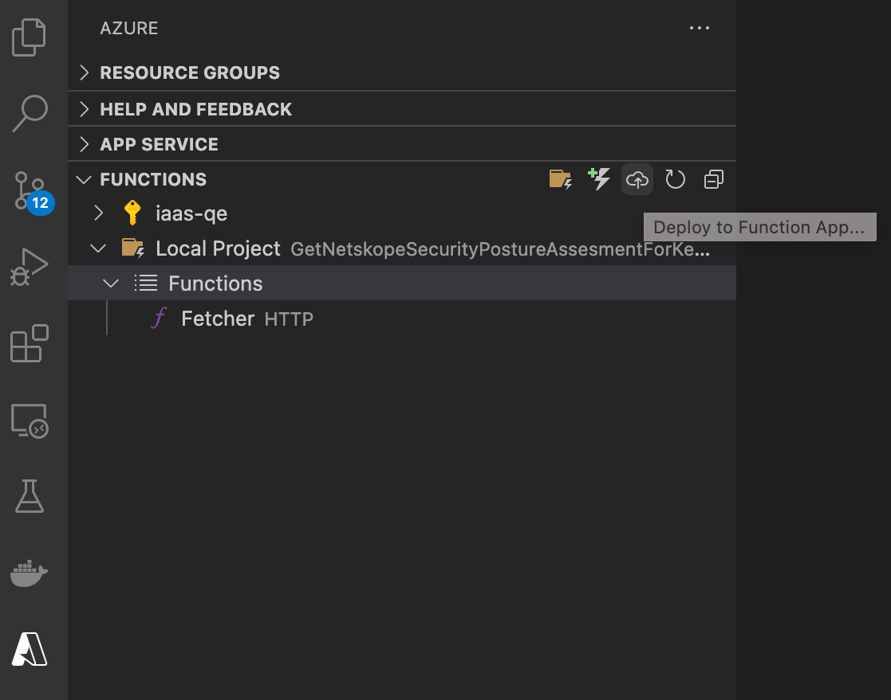
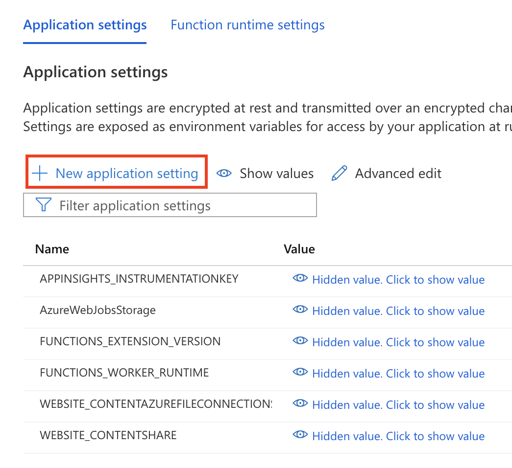
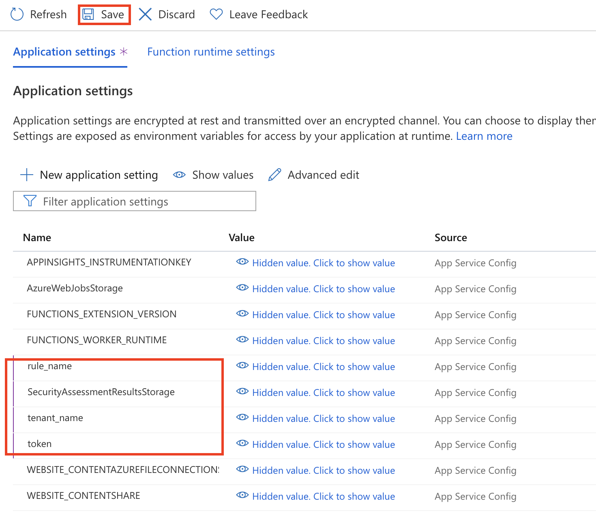
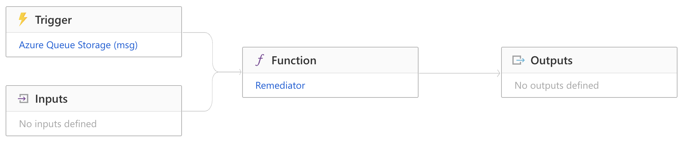
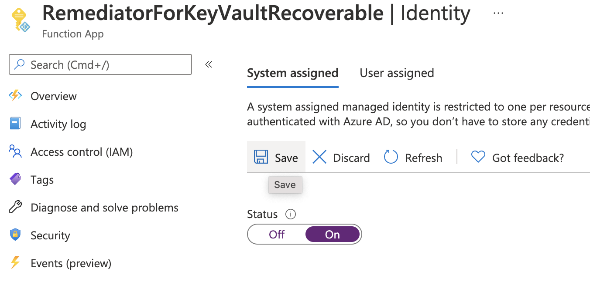
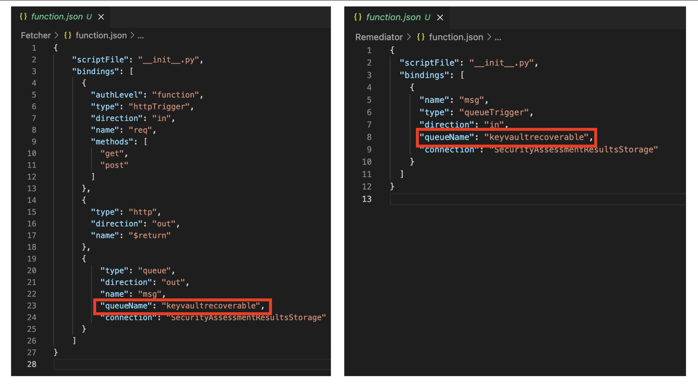

## Flow Diagram



## Prerequisites

### 1. Azure Storage Account For Netskope Security Assessment Result Store

This storage account used for NetskopeResultFetcher enqueue the resource id for the rule and Remediator dequeues the resource id to remediate the security violation.

#### A. Create Storage Account

Azure CLI:

```sh
az storage account create --name <STORAGE_NAME> --sku Standard_LRS
```

Names must contain three to 24 characters numbers and lowercase letters only. Standard_LRS specifies a general-purpose account, which is supported by Functions. Ref: [Create a storage account](https://docs.microsoft.com/en-us/azure/storage/common/storage-account-create?tabs=azure-portal)

#### B. Copy the Connection String for setup in function app Configuration to grant access to the storage account

Azure CLI:

```sh
az storage account show-connection-string --name MyStorageAccount --resource-group MyResourceGroup --subscription MySubscription
```

Azure Portal:

- In the Azure portal, open Storage Explorer
- Under Settings, select Access keys
- Click Show Keys
- Copy the entire connection string. Find the Connection string value under key1 or key2, and click the Copy button to copy the connection string.

Ref: [View Storage Account Access Key](https://docs.microsoft.com/en-us/azure/storage/common/storage-account-keys-manage?tabs=azure-portal#view-account-access-keys)

### Configure your environment to deploy Azure Function from VS Code

Make sure you have the following requirements in place:

- An Azure account with an active subscription. [Create an account for free](https://azure.microsoft.com/free).
- The [Azure Functions Core Tools](https://docs.microsoft.com/en-us/azure/azure-functions/functions-run-local#install-the-azure-functions-core-tools) version 3.x.
- [Python versions that are supported by Azure Functions](https://docs.microsoft.com/en-us/azure/azure-functions/supported-languages#languages-by-runtime-version)
- [Visual Studio Code](https://code.visualstudio.com/) on one of the [supported platforms](https://code.visualstudio.com/docs/supporting/requirements#_platforms).
- The [Python extension](https://marketplace.visualstudio.com/items?itemName=ms-python.python) for Visual Studio Code.
- The [Azure Functions extension](https://marketplace.visualstudio.com/items?itemName=ms-azuretools.vscode-azurefunctions) for Visual Studio Code

## FetcherForKeyVaultRecoverableHTTP

This function app gets the security assessment violations for the latest Netskope CSA scan from the customer tenant and enqueues the failing resource id to the configured Queue Storage Account



[Note] We can use Timer Trigger to run the function app as a cron job. Prefer to set a cron per day once or every six hours once or the time set in the instance listing on Netskope UI. Check Timer Trigger binding details in the reference section

### Deployment

 1) Download the GitHub Repository for Azure Remediator
        a. Click on the desired repository.
        b. Navigate to the “<>Code” tab.
        c. Click on the “Code” button on the right. A dropdown should appear.
        d. In the “Clone” menu, under the “HTTPS” tab, click on “Download ZIP”
 2) Unzip the Downloaded folder using `unzip <filename.zip>`
 3) change the directory to unzipped folder `cd unzip folder`
 4) Open VS Code by using `code .`
 5) Choose the Azure icon in the Activity bar, then in the Azure: Functions area, select the Local Project. Click Initialize Project for Use with VS Code...
 6) Deploy the Code to Function App: Choose the Azure icon in the Activity bar, then in the Azure: Functions area, choose the Deploy to function app... button.
     a. Provide the following information at the prompts:
            - Select folder: Choose a folder from your workspace or browse to one that contains your function app. You won't see this if you already have a valid function app opened.
            - Select subscription: Choose the subscription to use. You won't see this if you only have one subscription.
            - Select Function App in Azure: Choose + Create new Function App. (Don't choose the Advanced option, which isn't covered in this article.)
            - Enter a globally unique name for the function app: Type a name that is valid in a URL path. The name you type is validated to make sure that it's unique in Azure Functions.
            - Select a runtime: Choose the version of Python you've been running on locally. You can use the python --version command to check your version.
            - Select a location for new resources: For better performance, choose a region near you.
        b. The extension shows the status of individual resources as they are being created in Azure in the notification area.
        c. When completed, the following Azure resources are created in your subscription, using names based on your function app name:
            - A resource group, which is a logical container for related resources.
            - A standard Azure Storage account, which maintains state and other information about your projects.
            - A consumption plan, which defines the underlying host for your serverless function app.
            - A function app, which provides the environment for executing your function code. A function app lets you group functions as a logical unit for easier management, deployment, and sharing of resources within the same hosting plan.
            - An Application Insights instance connected to the function app, which tracks usage of your serverless function.
        d. A notification is displayed after your function app is created and the deployment package is applied.
            - Tip: By default, the Azure resources required by your function app are created based on the function app name you provide. By default, they are also created in the same new resource group with the function app. If you want to either customize the names of these resources or reuse existing resources, you need to instead publish the project with advanced create options.
        e. Select View Output in this notification to view the creation and deployment results, including the Azure resources that you created. If you miss the notification, select the bell icon in the lower right corner to see it again.
 7) Configure SecurityAssessmentResultsStorage, tenant_name, token, rule_name in Function App.
        Values for the Configuration
     a) SecurityAssessmentResultsStorage
         The Copied connection string from Prerequisites step 1.B
     b) Netskope Rest API Token
            Netskope REST APIs use an auth token to make authorized calls to the API. Netskope REST APIs provide access to resources via URI paths. The token must be used in every REST API call for the tenant. The token can be generated or revoked in the Netskope UI by going to Settings > Tools > Rest API v1.
     c) NetskopeTenantFQDN
            Your Netskope tenant FQDN. For example, myorg.goskope.com
     d) Rule Name
            The security assessment rule. For example, Ensure the key vault is recoverable
        The Application settings tab maintains settings that are used by your function app. You must select Show values to see the values in the portal. To add a setting in the portal, select New application setting and add the new key-value pair









## RemediatorForKeyVaultRecoverable

This function app gets the security assessment violations resource id from Queue Storage Account and remediates the security assessment violation for the resource based on resource id.



### Deployment

	Step 1 to 6 same as FetcherForKeyVaultRecoverableHTTP
 7) Configure SecurityAssessmentResultsStorage in Function App the value was Copied connection string from Prerequisites step 1. B
 8) Enable Managed Identity as system-assigned
        Enable System assigned Managed Identity to access other resources in Azure from Function App. (System Assigned Managed Identity is required for Remediator function app to be able to make appropriate changes to the violating resource)
            a. In the function app, navigate to Platform features. For other app types, scroll down to the Settings group in the left navigation.
            b. Select Identity.
            c. Within the System assigned tab, switch Status to On. Click Save.
    9) Add Role assignment for function app managed identity with appropriate permission level to the resources for the proper remediation for all the violation resources.
        a. Navigate to the desired resource on which you want to modify access control. In this example, we are giving Azure virtual machine access to a storage account, so we navigate to the storage account.
        b. Select Access control (IAM).
        c. Select Add > Add role assignment to open the Add role assignment page.
        d. Select the role and managed identity. For detailed steps, see [Assign Azure roles using the Azure portal](https://docs.microsoft.com/en-us/azure/role-based-access-control/role-assignments-portal).



[Note]  Queue name for Fetcher and Remediator needs to be the same in both function.json files in the Function. Attributes are not supported by Python. Whenever new Funtion App creation please change the QueueName in function.json


TODO: ARM Deployment

### Reference

Netskope REST API Token: <https://docs.netskope.com/en/netskope-platform-rest-apis.html>

Netskope endpoint for security assessment violation: <https://docs.netskope.com/en/view-security-assessment-violations.html>

Function App: <https://docs.microsoft.com/en-us/azure/azure-functions/>

Queue Storage Triggers and Bindings for Function App: <https://docs.microsoft.com/en-us/azure/azure-functions/functions-bindings-storage-queue>

HTTP Triggers for Function App: <https://docs.microsoft.com/en-us/azure/azure-functions/functions-bindings-http-webhook>

Timer Triggers for Function App: <https://docs.microsoft.com/en-us/azure/azure-functions/functions-bindings-timer?tabs=python>

Create Deploy JSON template: <https://docs.microsoft.com/en-us/azure/azure-resource-manager/templates/quickstart-create-templates-use-visual-studio-code?tabs=CLI>

Function App CLI: <https://docs.microsoft.com/en-us/azure/azure-functions/create-first-function-cli-python>

Function App VS Code: <https://docs.microsoft.com/en-us/azure/azure-functions/create-first-function-vs-code-python>

Continuous Deployment: <https://docs.microsoft.com/en-us/azure/azure-functions/functions-continuous-deployment>

FunctionApp ARM Template: <https://github.com/Azure/azure-quickstart-templates/tree/master/quickstarts/microsoft.web>
